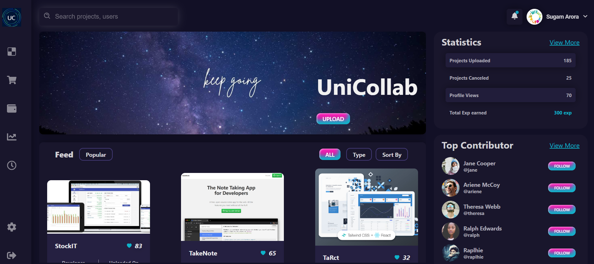

  

<h1>
UniCollab: Unleashing Collaborative Learning
</h1>
<h3>
Welcome to UniCollab, where knowledge knows no boundaries</h3>

## 👋 About UniCollab 

UniCollab is more than just a platform; it's a gateway to a world where students from different universities/colleges converge to collaborate, innovate, and elevate their projects. Imagine a space where ideas flow freely, where knowledge is shared effortlessly, and where learning transcends classrooms. That's UniCollab for you.

## 🖌️ Scope of the Project 

To actively contribute to UniCollab, I encourage you to delve into the [PROPOSED-AIM](AIM_OF_THIS_PROJECT.md) file which provides a comprehensive outline of our project's overarching goals and feature set. If you identify features that are needed but not yet implemented(as mostly are), please create an issue outlining the feature request for discussion and implementation. Your input will drive UniCollab's evolution as a dynamic and impactful platform for student collaboration.

## 🔄 Tech Stack

Proposed tech stack for project(although you are free to use any other stack outside of these):

1. **Backend:**
   - Node.js with Express.js for the server 💻
   - MongoDB for the database (using Mongoose for object modeling) 📊
   - Firebase Authentication for user authentication and authorization 🔐
   - Firebase Cloud Functions for serverless backend logic ☁️

2. **Frontend:**
   - React.js for a dynamic and responsive user interface ⚛️
   - HTML5, CSS3, JavaScript for elegant and modern design 🎨
   - Firebase Hosting for fast and secure web hosting 🚀
   - Firebase Realtime Database for real-time data synchronization 🔥

3. **DevOps & Deployment:**
   - Continuous Integration/Continuous Deployment (CI/CD): GitLab CI/CD for automated testing and deployment 🔄
   - Containerization: Docker for efficient and scalable deployment 🐳
   - Orchestration: Kubernetes for managing containerized applications ⚙️

4. **Cloud Platform:**
   - Hosting: AWS (Amazon Web Services) for reliable and scalable hosting ☁️
   - Serverless Computing: AWS Lambda for cost-effective and scalable backend services 🚀
   - Storage: AWS S3 for secure and scalable storage solutions 📦

5. **Machine Learning & AI:**
   - Frameworks: TensorFlow and PyTorch for advanced machine learning capabilities 🧠
   - Libraries: scikit-learn, pandas, NumPy for data manipulation and analysis 📊
   - Deployment: Docker containers for easy deployment of machine learning models 🐳

6. **Database:**
   - MongoDB for flexible and scalable NoSQL database solutions 📊

7. **Other Tools and Technologies:**
   - Websockets for real-time communication and collaboration features 🔄
   - Security: JWT (JSON Web Tokens) for secure authentication and authorization 🔒
   - Data Visualization: D3.js or Chart.js for interactive and visually appealing data representation 📊
   - Testing: Jest for React.js unit testing, Selenium for end-to-end testing 🧪

## ✔ Key Features

- **Project Showcase:** Showcase your projects and discover what other students are working on.
- **Collaborative Tools:** Work together seamlessly with integrated collaboration tools.
- **Knowledge Sharing:** Share insights, tips, and tricks with a community passionate about learning.
- **Career Opportunities:** Explore internship and job opportunities from our partner organizations.

## 🚀 Get Started

1. **Explore Projects:** Browse through projects and find ones that interest you.
2. **Create Your Profile:** Showcase your skills, projects, and aspirations.
3. **Start Collaborating:** Connect with like-minded individuals and start collaborating.

## 🛠️ Available Scripts

All contributors should look for [LEARN](LEARN.md). This file provides detailed instructions on how to build the project locally and contains other essential information. Whether you're new to the project or a seasoned contributor, the [LEARN](LEARN.md) file is a valuable resource for understanding the project's structure and requirements. 

## 📄 Documentation

Explore our comprehensive documentation in the [DOCUMENTATION](Documentation.md) file, which serves as a detailed guide to understanding and contributing to UniCollab. This document covers various aspects of the project, including setup instructions, architecture overview, and contribution guidelines. We recommend referring to this documentation to gain a deeper insight into UniCollab and make meaningful contributions to its development.

## 🛡️ License

This project is licensed under the MIT License - see the [LICENSE](LICENSE) file for details.

## 🌱 Contribute

We believe in the power of collaboration. If you have ideas to improve UniCollab, feel free to contribute! Check out our [Contribution Guidelines](CONTRIBUTING.md) to get started.

## 🤝 Contributors 
Kudos to you wonderful and dedicated contributors  

## 📬 Contact Details

You can connect with me on various platforms: 
   

## 🌟 Join Us 

Ready to embark on a journey of collaborative learning? Join UniCollab now and be a part of a community that believes in the power of collaboration!
Thank you for contributing to our open-source project! We appreciate your support 🚀
Don't forget to leave a star ⭐

{<a href="#top">Back to top</a>}
