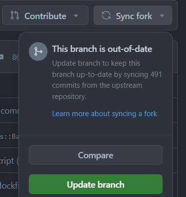

Make Sure that your branch is up to date with the master branch(remotely) before you push your code to the remote repository.

Step 1: Firstly you need to go to your cloned repo on browser and then click on sync fork and update branch. Here is the sample shown below 



Step 2: Now you need to go to your terminal and then run the following commands
```bash
#!/bin/bash
# This script will update your branch with the master branch
# Make sure that you are in the branch that you want to update
# Usage: ./branchupdate.sh
git checkout master/main
git pull
git checkout {your-branch-name}
git merge master/main
```

Follow the above steps to create a script file and run the script file to update your branch with the master branch.
You can either directly use these steps in terminal for branch update or create a script file for the same.
Make sure that you are in the branch that you want to update before running the script file.
This is a simple script that will update your branch with the master branch. You can modify the script according to your requirements.
Hope this helps.