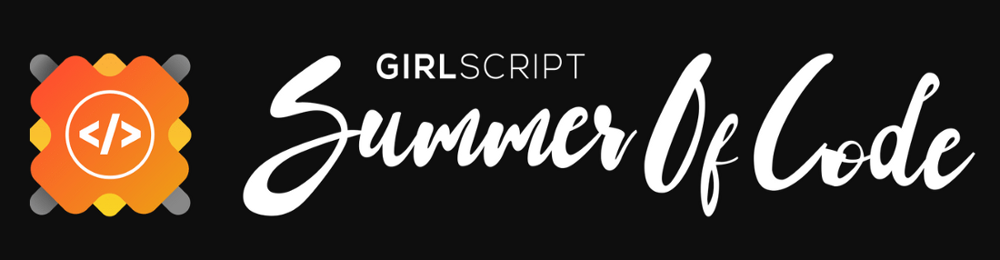

# Home 

 
 

<h3>
Welcome to UniCollab, where knowledge knows no boundaries</h3>

### 👋 About UniCollab 

UniCollab is more than just a platform; it's a gateway to a world where students from different universities/colleges converge to collaborate, innovate, and elevate their projects. Imagine a space where ideas flow freely, where knowledge is shared effortlessly, and where learning transcends classrooms. That's UniCollab for you.

### 🏅 Featured in 

  

<a href="#top" style="font-size: 29px;">🔝</a>

